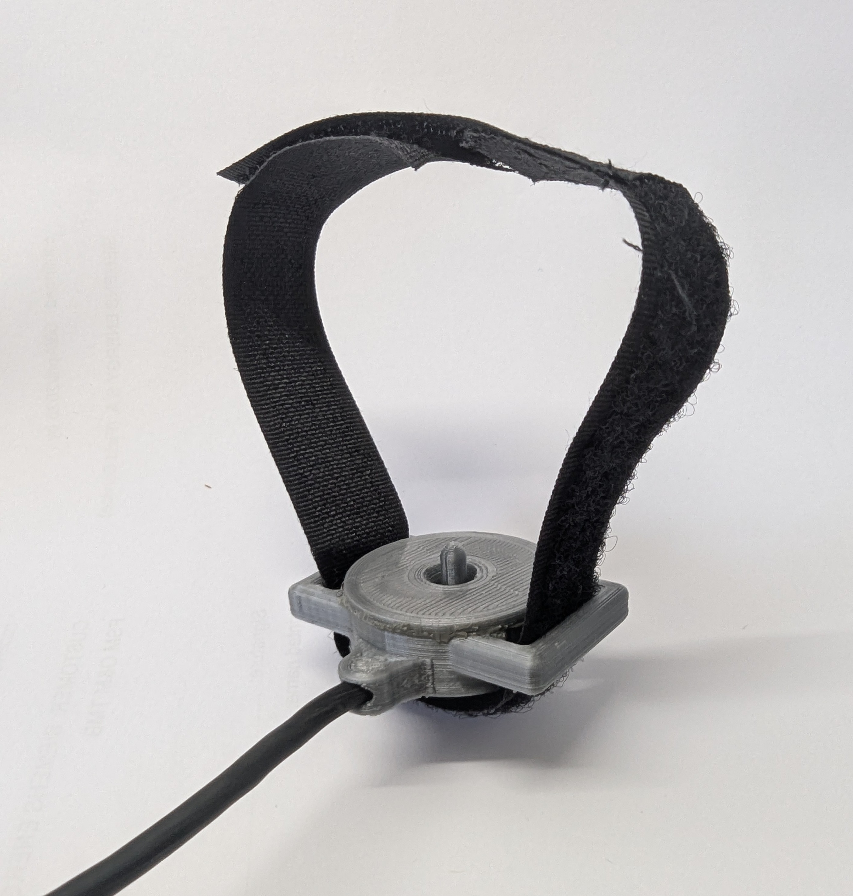

# VDA_Mechanical

This repository contains the mechanical design files for the **VDA Signal Acquisition System**, including the 3D-printed wrist-mounted sensor enclosure and the main electronics housing.

## 📁 Repository Structure

- **/Pulsera**  
  Contains the 3D models and drawings of the wristband enclosure that houses the piezoelectric sensor.

- **/Gabinete**  
  Contains the mechanical design of the acquisition unit enclosure, which holds the main electronics.

## 🧩 Design Details

- All parts are designed for **FDM 3D printing**
- Recommended material: **PLA**
- Designs tested with standard 0.4 mm nozzle and 0.2 mm layer height
- Fastening methods include M3 screws and epoxy sealing
- Tolerances were adjusted for typical consumer-grade printers

## 📂 Included Files

- `.STL` files (ready to print)
- `.STEP` files (for editing or integration)
- Reference images and dimensioned drawings

## 🧷 Assembly Notes

- The main enclosure is assembled using two half-shells joined by screws. Front and rear panels are implemented as PCBs for manufacturing simplicity and connector alignment.

## 🛡 License

All 3D models and mechanical files are shared under the **Creative Commons Attribution-NonCommercial 4.0 International (CC BY-NC 4.0)** license.

You may copy, remix, transform, and build upon the material for non-commercial purposes, as long as proper credit is given.

🔗 https://creativecommons.org/licenses/by-nc/4.0/

## 📬 Contact

For further information or collaboration proposals, please open an issue or contact me.

[leandrozabala@mdp.edu.ar](leandrozabala@mdp.edu.ar)